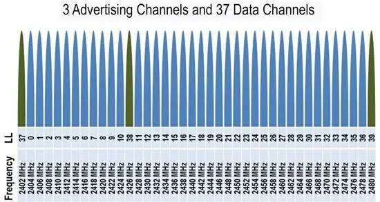

# BLE相关笔记
` PS：未完待续`

这几个月一直在做BLE应用层的开发，随手记录一下BLE相关的笔记，主要是BLE协议栈部分。

## 基本概念
* 1、BLE无线属性

  BLE，即蓝牙低功耗（Bluetooth Low Energy），工作在2.4GHz的频段（2402-2480MHz），共有40个信道：分别从0-39，每个信道带宽为2MHz，其中3个广播道为：37-38-39：`2402MHz-2426MHz-2480MHz`与37个数据信道，详情见下图:

    

 
  最常见的BLE通讯速率为1Mbit/s，也有2Mbit/s、500kbit/s、125kbit/s。
  空口环境良好请款下,ble设备完成一次连接事件（扫描、创建链接、发送数据）只需3ms左右； 空旷环境下，发送功率在+4dBm，可以达到70m的传输距离；

* 2、BLE主从机、广播与扫描

  BLE的角色有以下几种：广播者（Advertise）、扫描者（Scanner）、从设备（Slave）、主设备（Master）、发起者（Initiator）。

  两个BLE设备连接后，一个是主机一个是从机。连接前，从机在广播通道发送广播，主机在广播通道扫描广播，主机发现从机广播后，发起连接请求，主从机连接建立。

## BLE协议栈

* 1、协议栈
* 2、包解析

  **->广播包**

  **->心跳包**
  
  **->数据包**
